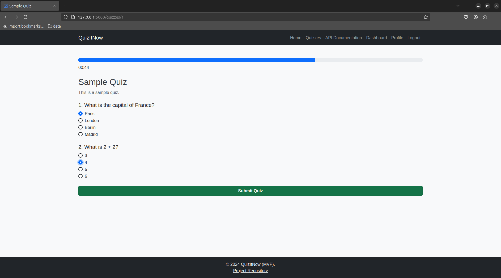

# QuizItNow

## Table of contents
- [Overview](#overview)
- [Features](#features)
- [Tech Stack](#tech-stack)
- [Installation](#installation)
- [Usage](#usage)
- [Milestones](#milestones)
- [Project Structure](#project-structure)
- [Contributing](#contributing)
- [Licensing](#licensing)
- [App links](#app-links)
- [Authors links](#authors-links)
## Overview
The QuizItNow Application is a web-based platform that allows users to answer multiple-choice questions, receive feedback, and view their scores. This project leverages Python (Flask), HTML, CSS, and Bootstrap to provide an engaging and interactive user experience. It is designed to reinforce Python programming skills and web development basics.
## Features
- **Authentication System**: Secure user login and session management.
- **Quiz System**: Multiple-choice questions with scoring and time limits.
- **Responsive Design**: Optimized for use on desktop and mobile devices.
- **User Accounts**: Stores quiz results for each user.
- **Extendable Questions**: Easily add new sets of quiz questions.
- **REST API**: Expose quiz questions via a REST API.
## Tech Stack
- **Backend**: Python (Flask)
- **Frontend**: HTML, CSS, Bootstrap
- **Database**: SQLite (for storing user data and quiz results)
## Installation
### Prerequisites
- **Python**
- **Virtual environment tool** (venv)
- **A database system** (SQLite)
### Steps
1. **Clone the repository:**
```bash
git clone https://github.com/mi7773/quizitnow.git
cd quizitnow
```
2. **Create a virtual environment and activate it:**
```bash
python -m venv venv
source venv/bin/activate
```
3. **Install dependencies:**
```bash
pip install -r requirements.txt
```
4. **Set up the database:**
```bash
python create_db.py
python add_sample_data.py
```
The `add_sample_data.py` script will:
- create two users:
  - An **admin** user with the username `mi7773` and the password `password`
  - A **regular** user with the username `alice99` and the password `password`
- Create **Sample Quiz** with sample questions.
5. **Run the application:**
```bash
python run.py
```
6. **Open the application in your browser at** `http://127.0.0.1:5000/`
## Usage
1. Register an account or log in with existing credentials.
2. Start a quiz by selecting one
3. Answer questions within the allotted time and receive feedback.
4. View your score and progress on the dashboard.
5. (Admin Only) Add new quizzes.
## Milestones
1. **Auth System/Session Management**
  - Secure user authentication and session handling.
2. **Storage of Quiz Results**
  - Store user scores and quiz data in a database.
3. **Responsive Design**
  - Ensure compatibility across devices and screen sizes.
4. **Bonus Features**
  - Add functionality to add new quiz question sets.
  - Expose quiz questions through a REST API for integration with other applications.
## Project Structure
```bash
quizitnow/
├── README.md			# Project documentation.
├── add_sample_data.py		# Script to populate the database with sample data for testing and development.
├── app
│   ├── __init__.py		# Initializes the Flask app and integrates various components.
│   ├── assets			# Folder including images for the README.
│   ├── config.py		# Configuration settings for the application (e.g., database URI, environment).
│   ├── error_handlers.py	# Custom error handling logic for the application.
│   ├── extensions.py		# Extensions and libraries initialized for use in the app (e.g., Flask-SQLAlchemy).
│   ├── models			# Database models.
│   ├── routes			# Application routes.
│   ├── static			# Static files (CSS, images).
│   └── templates		# HTML templates.
├── create_db.py		# Script to create and initialize the database schema.
├── requirements.txt		# Python dependencies.
├── run.py			# Entry point to run the Flask application.
└── tests			# Test cases.
```
## Contributing
1. **Fork the repository.**
2. **Create a new branch:**
```bash
git checkout -b feature-name
```
3. **Make your changes and commit them:**
```bash
git commit -m "Add feature-name"
```
4. **Push to your fork and submit a pull request.**
## Licensing
You are welcome to explore, modify, and share this project freely! While it's not mandatory, acknowledging the original creators is appreciated.
## App links
- [Landing page](https://mi7773.pythonanywhere.com/)
- [Demo Video](https://youtu.be/kV3-70LX0nw)
- [GitHub Repository](https://github.com/mi7773/quizitnow)
- [LinkedIn Article](https://www.linkedin.com/pulse/from-whiteboard-web-my-solo-adventure-quizitnow-mahmoud-ismail-tehzf)
- [Presentation](https://docs.google.com/presentation/d/1MctEudXzDfQmsTdj87xCxA0gX0TIV4DAAoaO3lEdbIs/edit?usp=sharing)
- [Trello board](https://trello.com/invite/b/676e3e6e73ef2eeb1f17d07e/ATTI81e46b1fdef30cf31663f9fbee1542b652473F0A/quizitnow)
## Authors links
- Mahmoud Ismail
  - [LinkedIn](https://www.linkedin.com/in/mi7773/)
  - [GitHub](https://github.com/mi7773)
  - [X](https://x.com/mi7773)
  - [Discord](https://discordapp.com/users/1106153071706394677)
  - [Email](mailto:mahmoudismailabdelrazek@gmail.com)
  - [WhatsApp](https://wa.me/201282244419)
